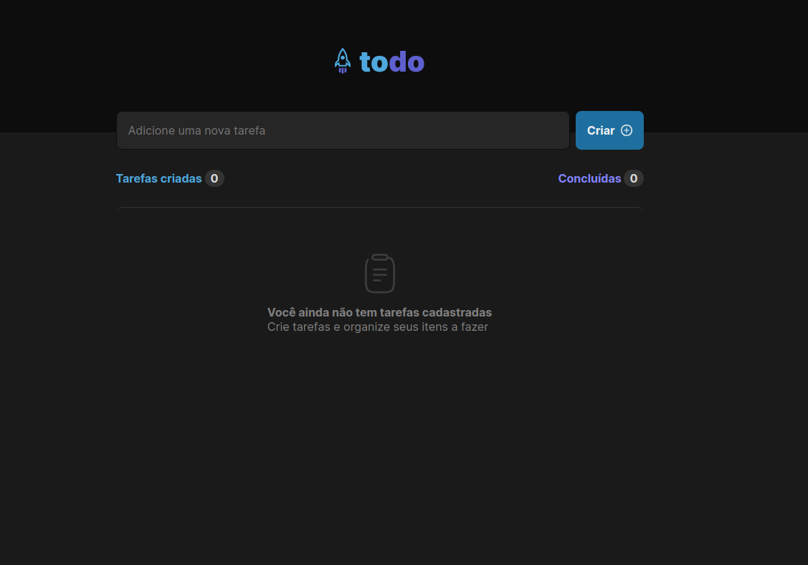
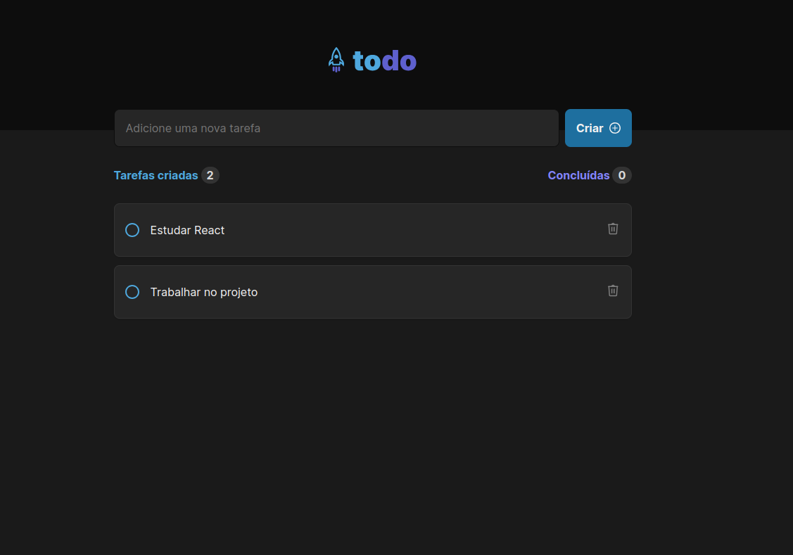
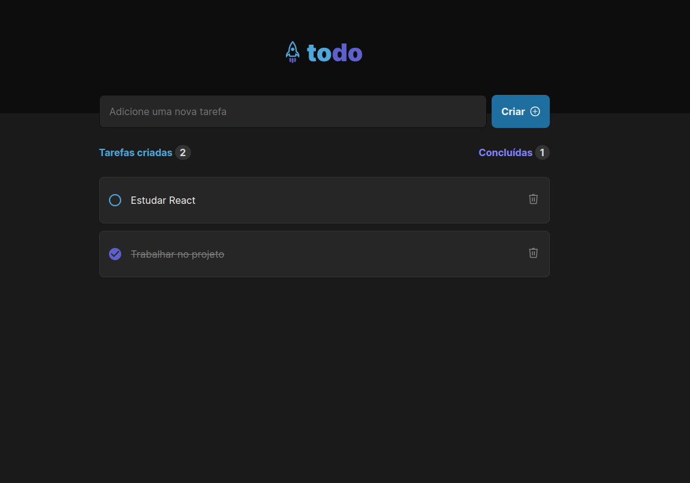

# To do





> O To do é um projeto proposto pela Jornada Ignite do 🔗[React](https://react.dev/) da 🔗[RocketSeat](https://app.rocketseat.com.br), para reforçar conceitos importantes. A aplicação consiste em um simples controle de tarefas(to-do list).

<br>

### Pré-requisitos e como rodar o projeto

- É preciso pelo menos a versão **v20** do Node

Após clonar o projeto e se certificar de está no local adequado é só rodar:

```
npm install
```

e em seguida

```
npm run dev
```
